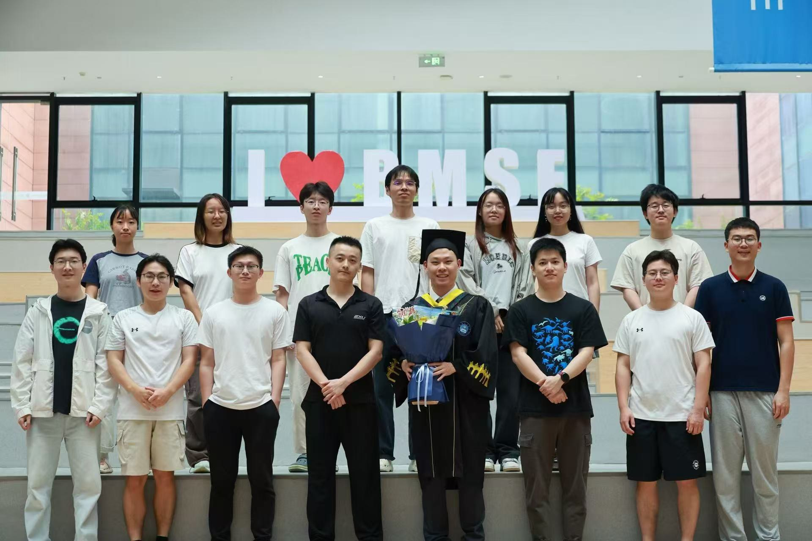
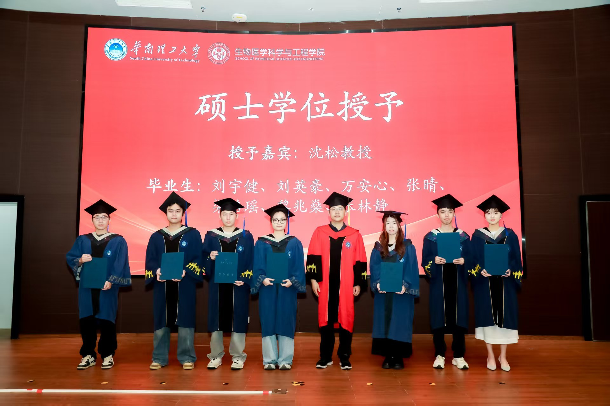

Celebrating Our 2026 Graduates
<!--more-->

On June 10, 2026, our group gathered to celebrate the graduation of our students and mark this important milestone together. Congratulations to Yujian Liu and Yinghao Liu on receiving their master's degrees, and to Yutong Wang and Qingquan Wang on receiving their bachelor's degrees. We wish all of our graduates every success and happiness as they embark on the next chapter of their journeys.

As part of the graduation ceremony, Prof. Xu joined students from the next cohort in performing the song *Chapter* (篇章) for the graduates. The performance conveyed heartfelt wishes, enthusiasm, and anticipation for the graduates as they set out on new journeys.

Happy graduation to all our graduates, and best wishes for the exciting chapters ahead!
